# 🚀 SwiftPay

A distributed payment processing system built using **Spring Boot, Apache Kafka, PostgreSQL, Redis, Docker, and GitHub Actions**.

SwiftPay follows an **event-driven microservices architecture**, where payment processing is asynchronous, fault-tolerant, and idempotent.

---

# ✨ Features

- ✅ Event-driven payment processing using Apache Kafka
- ✅ Asynchronous communication between microservices
- ✅ Redis-based idempotency
- ✅ Ledger service for account balance updates
- ✅ Payment Success & Failure event handling
- ✅ Analytics worker for completed transactions
- ✅ Transaction history API
- ✅ PostgreSQL persistence
- ✅ Docker & Docker Compose support
- ✅ Multi-stage Docker builds
- ✅ GitHub Actions CI pipeline
- ✅ OpenAPI / Swagger documentation

---

# 🏗️ Architecture

```
                           +-------------------------+
                           |   Transaction Gateway   |
                           |       (REST API)        |
                           +-----------+-------------+
                                       |
                              PaymentInitiated Event
                                       |
                                       ▼
                               +---------------+
                               |     Kafka     |
                               +-------+-------+
                                       |
                                       ▼
                             +-------------------+
                             |  Ledger Service   |
                             +---------+---------+
                                       |
                     +-----------------+-----------------+
                     |                                   |
                     ▼                                   ▼
          PaymentCompleted Event             PaymentFailed Event
                     |                                   |
          +----------+----------+                        |
          |                     |                        |
          ▼                     ▼                        ▼
Transaction Gateway     Analytics Service      Transaction Gateway
(Update Payment)       (Store Analytics)       (Mark FAILED)
```

---

# 🛠️ Tech Stack

| Technology | Purpose |
|------------|---------|
| Java 21 | Programming Language |
| Spring Boot | Microservices |
| Spring Data JPA | Database Access |
| Spring Kafka | Event Streaming |
| PostgreSQL | Relational Database |
| Redis | Idempotency |
| Apache Kafka | Messaging |
| Docker | Containerization |
| Docker Compose | Local Orchestration |
| Maven | Build Tool |
| GitHub Actions | Continuous Integration |

---

# 📂 Project Structure

```
swiftpay/

├── transaction-gateway/
│
├── ledger-service/
│
├── analytics-service/
│
├── docker-compose.yml
│
└── .github/
    └── workflows/
```

---

# 🔄 Payment Processing Flow

```
Client

        │
        ▼

POST /v1/payments

        │
        ▼

Transaction Gateway

        │
        ▼

Store Payment (PENDING)

        │
        ▼

Publish PaymentInitiated Event

        │
        ▼

Kafka

        │
        ▼

Ledger Service

        │
        ├── Validate Sender
        ├── Validate Receiver
        ├── Check Balance
        ├── Debit Sender
        └── Credit Receiver

        │
        ▼

Publish PaymentCompleted
        OR
Publish PaymentFailed

        │
        ▼

Transaction Gateway updates Payment Status

        │
        ▼

Analytics Service stores completed transaction
```

---

# 📬 Kafka Topics

| Topic | Producer | Consumer |
|--------|----------|----------|
| payment-initiated | Transaction Gateway | Ledger Service |
| payment-completed | Ledger Service | Transaction Gateway, Analytics Service |
| payment-failed | Ledger Service | Transaction Gateway |

---

# 🗄️ Database Tables

### Transaction Gateway

- payments

### Ledger Service

- accounts

### Analytics Service

- analytics_events

---

# 🚀 Getting Started

## Quick Start

Clone the repository:

```bash
git clone https://github.com/shrajan9696/swiftpay.git
cd swiftpay
```

Start the complete ecosystem:

```bash
docker compose up --build
```

This will start:

- PostgreSQL
- Redis
- Apache Kafka
- Kafka UI
- Transaction Gateway
- Ledger Service
- Analytics Service

---

# 📖 API Documentation

## Swagger UI

### Transaction Gateway

```
http://localhost:8080/swagger-ui.html
```

### Ledger Service

```
http://localhost:8082/swagger-ui.html
```

---

# 📌 Available APIs

| Method | Endpoint | Description |
|---------|----------|-------------|
| POST | `/v1/payments` | Initiate a payment |
| GET | `/v1/payments/history?accountId={id}` | Retrieve transaction history |

---

# 💳 Initiate Payment

### Request

```http
POST /v1/payments
```

```json
{
  "transactionId": "TXN1001",
  "senderId": 101,
  "receiverId": 102,
  "amount": 87,
  "currency": "INR"
}
```

### Response

```json
{
  "transactionId": "TXN1001",
  "status": "PENDING",
  "message": "Payment accepted for processing.",
  "paymentId": "xxxxxxxx-xxxx-xxxx-xxxx-xxxxxxxxxxxx"
}
```

---

# 📜 Transaction History

### Request

```http
GET /v1/payments/history?accountId=101
```

### Sample Response

```json
[
  {
    "transactionId": "TXN1001",
    "senderId": 101,
    "receiverId": 102,
    "amount": 87,
    "currency": "INR",
    "status": "SUCCESS"
  },
  {
    "transactionId": "TXN1002",
    "senderId": 101,
    "receiverId": 102,
    "amount": 150,
    "currency": "INR",
    "status": "FAILED"
  }
]
```

---

# 📊 Analytics Worker

The Analytics Service listens to the **payment-completed** Kafka topic.

Whenever a payment is completed successfully, it stores an analytics record into the `analytics_events` table.

Example:

| Event Type | Transaction ID |
|------------|----------------|
| PAYMENT_COMPLETED | TXN1027 |

This demonstrates a simple event-driven analytics pipeline.

---

# 🐳 Docker

The project uses **multi-stage Docker builds**.

Benefits:

- Smaller production images
- Faster deployments
- No Maven installation required in runtime containers
- Reproducible builds

---

# 🔁 CI/CD

GitHub Actions automatically executes on every push to the **main** branch.

Pipeline Steps:

- Checkout Repository
- Setup Java 21
- Build Transaction Gateway
- Build Ledger Service
- Build Analytics Service
- Execute Maven Build

Workflow Status:

```
GitHub Actions ✓ Passing
```

---

# 📸 Screenshots

The repository includes screenshots demonstrating:

- Swagger UI

  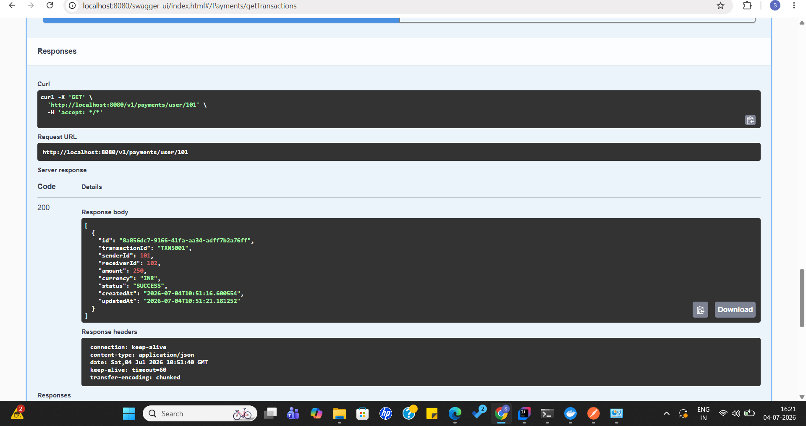
  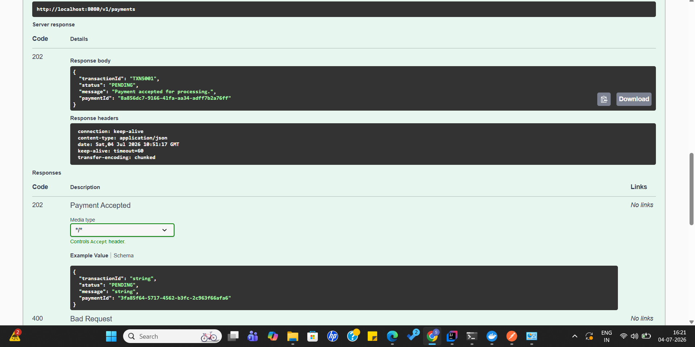
  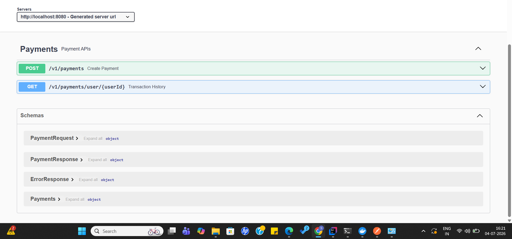
  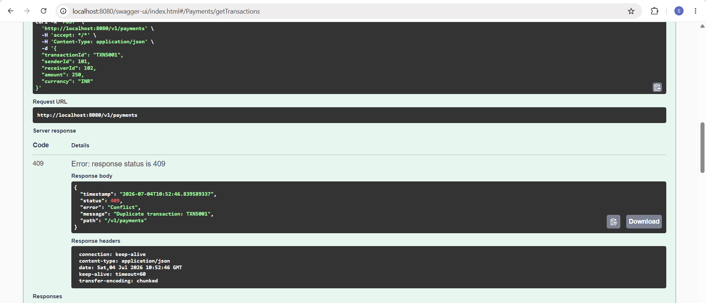
- Kafka UI
  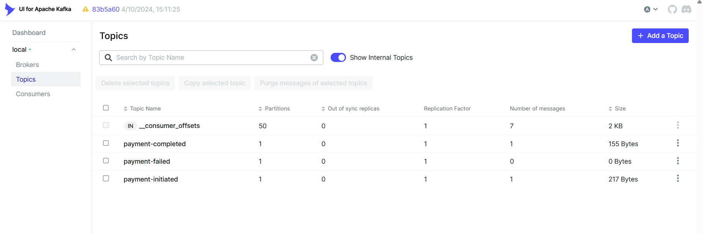
 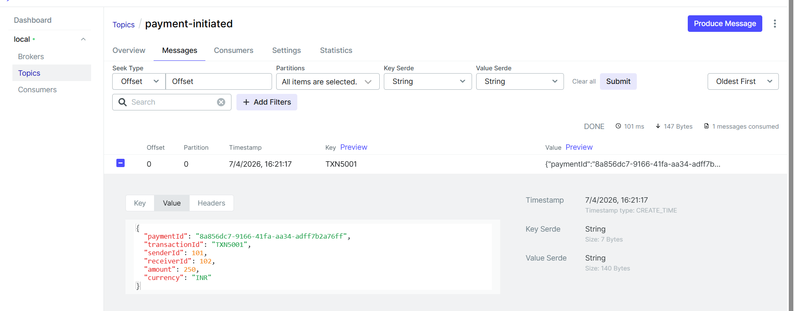
 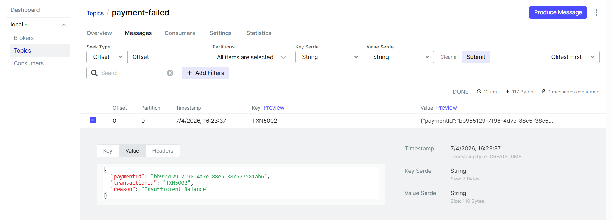
 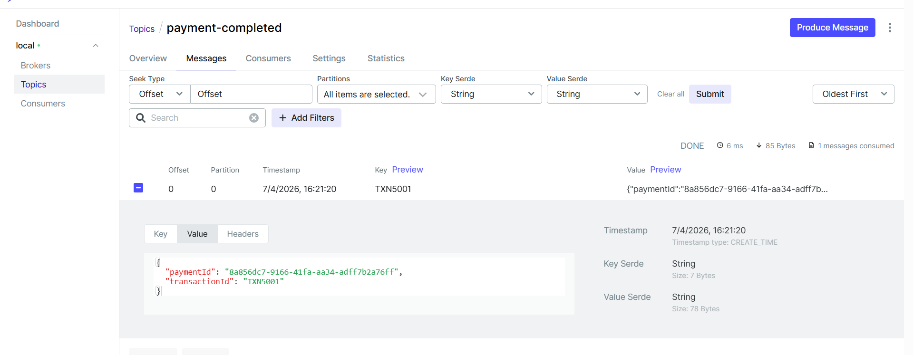
- Docker
  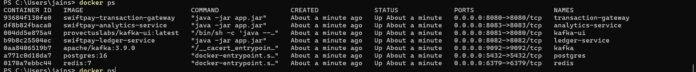
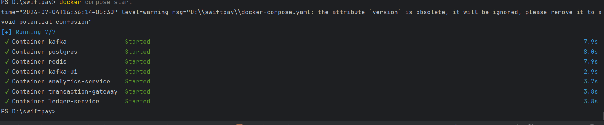
- Tables
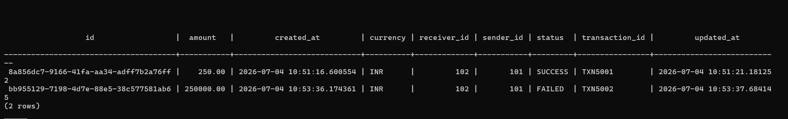
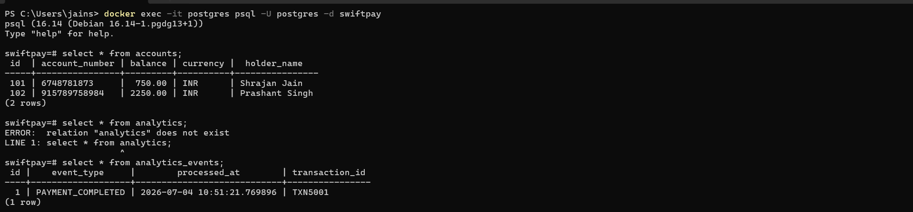
- Load Testing
    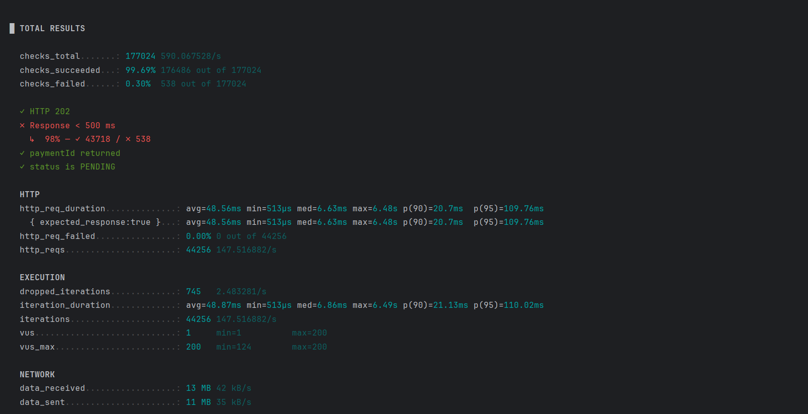
    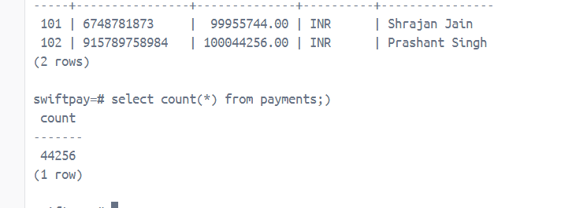
    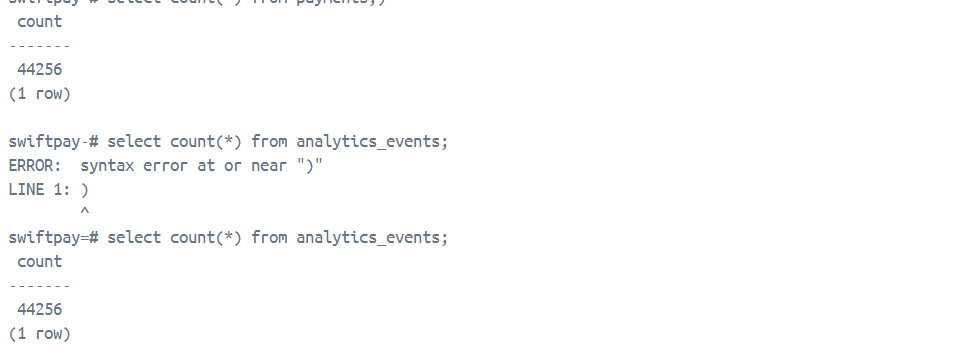
    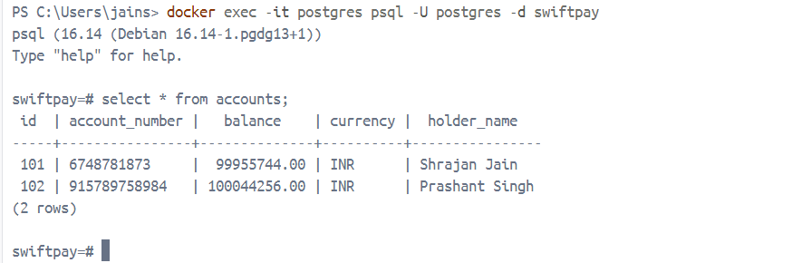


---
# 👨‍💻 Author

**Shrajan Jain**

GitHub: https://github.com/shrajan9696

---

## Assignment Highlights

- Event-Driven Microservices
- Apache Kafka Messaging
- Redis-based Idempotency
- Dockerized Deployment
- Multi-stage Docker Builds
- GitHub Actions CI
- PostgreSQL Persistence
- Analytics Worker
- REST APIs with Swagger
